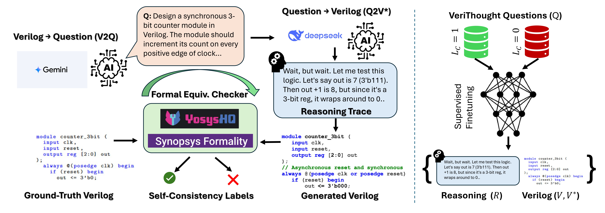

# VeriThoughts: Enabling Automated Verilog Code Generation using Reasoning and Formal Verification
This is the repository for the VeriThoughts Dataset, the first large scale formally verified Verilog reasoning dataset. This repository contains all of the code necessary to generate VeriThoughts as well as our model training and evaluation code.

Our datasets can be found on HuggingFace: [Link](https://huggingface.co/collections/wilyub/verithoughts-datasets-6826de76e798014f05de6c0f)

Our fine-tuned Verilog models can be found on HuggingFace: [Link](https://huggingface.co/collections/nyu-dice-lab/verithoughts-models-681eead7cd13abeb5957baf3)

<p align="center">
  
</p>

## Table of Contents

1. [VeriThoughts](#VeriThoughts)
2. [Training](#Training)
3. [Evaluation: VeriThoughts](#evaluation-verithoughts)
4. [Evaluation: Verilog Eval](#evaluation-verilog-eval-human)

## VeriThoughts
1. Clone and install the repo.
```
git clone https://github.com/wilyub/VeriThoughts.git
cd VeriThoughts/verithoughts
```
2. Install dependencies using the requirements.txt
3. Install Yosys by following the instructions:
```
https://yosyshq.readthedocs.io/projects/yosys/en/0.41/getting_started/installation.html#
```
4. Run the VeriThoughts generation script.
```
python multi-turn-yosys-generation.py --start_idx 0 --end_idx 25090 --label_start 0 --batch_file_path your/file/path --gemini_key your_gemini_key --deepseek_key your_deepseek_key --yosys_location your/yosys/location
```
## Training
1. Go to sub-repo
```
cd VeriThoughts/training
```
2. Install LlamaFactory by following the instructions:
```
https://github.com/hiyouga/LLaMA-Factory?tab=readme-ov-file#installation
```
3. Install dependencies using the requirements.txt
4. Download all training datasets from HuggingFace and store them in VeriThoughts/training/verilogFinetune/data
5. For each ".sh" file in VeriThoughts/training/verilogFinetune:
```
chmod +x file_name.sh
./file_name.sh
```
## Evaluation: VeriThoughts
1. Go to sub-repo
```
cd VeriThoughts/evaluation_verithoughts
```
2. Download the benchmark data from HuggingFace and store it in VeriThoughts/evaluation_verithoughts.
3. Install dependencies using the requirements.txt
4. Generate benchmark responses:
```
python verilog_vllm_multi.py --model_id nyu-dice-lab/Qwen-2.5-Instruct-Verilog-Reasoning-7B --sample_number 20 --batch_size 100 --reasoning_mode --hf_read_token your_hf_token --benchmark_path  your_benchmark_path --tensor_parallel_size 4
```
4. Evaluate the generated responses.
```
python evaluation_script.py --results_path your/generated/jsonl --samples_per_question 20 --yosys_location your/yosys/location --benchmark_path your/benchmark/path
```
## Evaluation: Verilog Eval Human
1. Go to sub-repo
```
cd VeriThoughts/verilog-eval
```
2. Install dependencies using the requirements.txt
3. Install verilog-eval
```
git clone https://github.com/NVlabs/verilog-eval/tree/release/1.0.0
pip install -e verilog-eval
```
4. Generate benchmark responses:
```
python verilog_eval_generate_vllm.py --model_id your/model/id --gpu 0 --bench_type human --hf_token my_hf_token
```
5. Follow the steps in Verilog_Eval_Test.ipynb to calculate pass@k.
